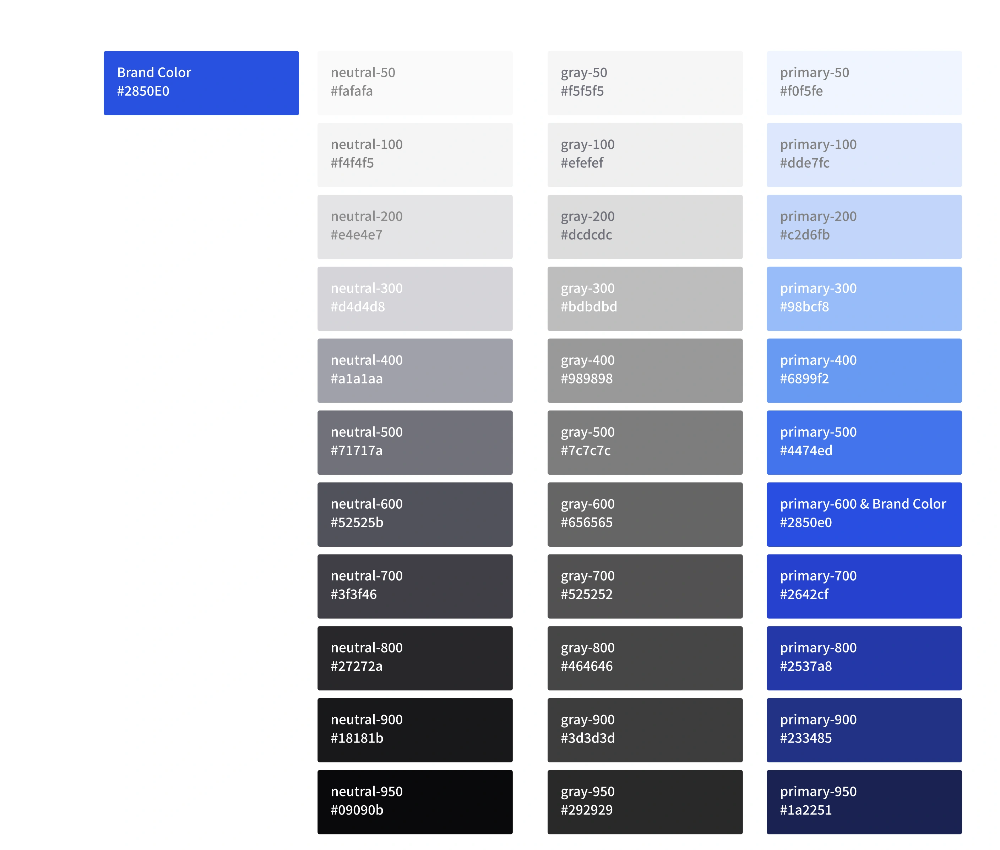

# xionwcfm-lib

`xionwcfm-lib` 는 `xionwcfmmonorepo`의 공통 코드베이스 유틸을 분리하여 원격 패키지로 관리합니다.


## Available Packages

### **[@xionwcfm/jotai](https://github.com/XionWCFM/xionwcfm-lib/blob/main/packages/jotai/README.md)**

jotai를 래핑하는 작은 라이브러리입니다.

자세한 사용예시는 [@xionwcfm/jotai readme](https://github.com/XionWCFM/xionwcfm-lib/blob/main/packages/jotai/README.md)에서 확인해주세요


jotai를 peer dependencies로 가집니다.

```
pnpm i jotai @xionwcfm/jotai
```

---


### [**@xionwcfm/token**](https://www.figma.com/design/YcU2Y4i68qsLFupoxgssPh/Xion-Design-System?node-id=0-1&t=hn9cP9ogyD1wri0D-1)

```
pnpm i @xionwcfm/token
```




color , spacing 등 디자인에 필요한 토큰들을 정의합니다.

css variables에 의존하기 때문에 사용 시 css를 import 하여 주세요

[DesignSystem Figma]((https://www.figma.com/design/YcU2Y4i68qsLFupoxgssPh/Xion-Design-System?node-id=0-1&t=hn9cP9ogyD1wri0D-1))에서 더 많은 정보를 얻을 수 있습니다.


tailwindcss를 사용한다면 token을 다음과 같이 통합할 수 있습니다.


`tailwind.config.ts`
```tsx
import { XION_STYLE } from "@xionwcfm/token";
import type { Config } from "tailwindcss";

const config: Config = {
  content: ["./src/**/*.{js,ts,jsx,tsx,mdx}", "./app/**/*.{js,ts,jsx,tsx,mdx}"],
  theme: {
    colors: XION_STYLE.colors,
    borderRadius: XION_STYLE.borderRadius,
    spacing: XION_STYLE.spacing,
    fontSize: XION_STYLE.fontSize,
    fontWeight: XION_STYLE.fontWeight,
    lineHeight: XION_STYLE.lineHeight,
    boxShadow: XION_STYLE.boxShadow,
    extend: {
      keyframes: XION_STYLE.keyframes as Config["theme"],
      animation: XION_STYLE.animation,
      screens: XION_STYLE.screens,
    },
  },
};
export default config;

```


---

### **[@xionwcfm/xds](https://xionwcfm-lib.vercel.app/)**

```
pnpm i @xionwcfm/token @xionwcfm/xds
```

모바일 웹뷰 개발에 최적화된 디자인 시스템을 제공합니다.

프로젝트의 통일성을 위해 `@xionwcfm/token`을 함께 사용하는 것을 권장합니다.


자신의 프로젝트의 Root에서 Import를 수행합니다.

```tsx
import "@xionwcfm/token/style";
import "@xionwcfm/xds/style";
```

사용 가능한 컴포넌트는 [@xionwcfm/xds storybook](https://xionwcfm-lib.vercel.app/)에서 확인하세요


---

### **@xionwcfm/react**

```
pnpm i @xionwcfm/react
```

디자인이 관심사가 아닌 컴포넌트와 유용한 커스텀훅을 제공합니다.

peer dependencies

```
  "peerDependencies": {
    "react": ">=18",
    "react-dom": ">=18"
  }
```

자세한 사항은 [@xionwcfm/react source code](https://github.com/XionWCFM/xionwcfm-lib/tree/main/packages/react/src)를 참고하세요

